---
## Front matter
lang: ru-RU
title: Лабораторная работа №1
subtitle: Установка и конфигурация операционной системы на виртуальную машину
author:
  - Кучмар С. И.
institute:
  - НММ-02-24
date: 05 марта 2024

## i18n babel
babel-lang: russian
babel-otherlangs: english

## Formatting pdf
toc: false
toc-title: Содержание
slide_level: 2
aspectratio: 169
section-titles: true
theme: metropolis
header-includes:
 - \metroset{progressbar=frametitle,sectionpage=progressbar,numbering=fraction}
---

# Информация

## Докладчик

:::::::::::::: {.columns align=center}
::: {.column width="70%"}

  * Кучмар София Игоревна
  * Аналитик данных
  * Студент факультета физико-математических и естественных наук
  * Российский университет дружбы народов
  * [1132246765@pfur.ru](mailto:1132246765@pfur.ru)

:::
::: {.column width="30%"}

:::
::::::::::::::

# Вводная часть

## Актуальность

-  Критически важные навыки для современной IT-индустрии.
-  Необходимость Linux-окружения для разработки, администрирования, тестирования, исследований и документации.
-  Обеспечивает эффективное создание технической документации (Markdown, TeX Live).
-  Фундамент для дальнейшего изучения Linux и смежных технологий.
-  Virtualbox упрощает обучение и эксперименты

## Объект и предмет исследования

- Процесс установки и настройки операционной системы Linux на виртуальной машине Virtualbox.
- Этапы установки, настройки (автообновление, SELinux, раскладка клавиатуры и т.д.) и установка необходимого программного обеспечения (Markdown, TeX Live) для создания рабочей среды.

## Цели и задачи

- Установка Linux на Virtualbox.
- Установка инструментов для Markdown и TeX Live.

## Материалы и методы

1. Установка ОС: Использование графического установщика Linux в Virtualbox.
2. Настройка ОС: Командная строка и редактирование конфигов для автообновления, отключения SELinux, настройки клавиатуры и т.д.
3. Установка ПО: Менеджер пакетов (apt/dnf) для установки Markdown и TeX Live.
4. Тестирование: Создание и просмотр тестовых документов Markdown и LaTeX.

# Выполнение работы

## Работа в VirtualBox

Проведём настройку папки в VirtualBox и создадим виртуальную машину с необходимыми настройками.

:::::::::::::: {.columns align=center}
::: {.column width="50%"}

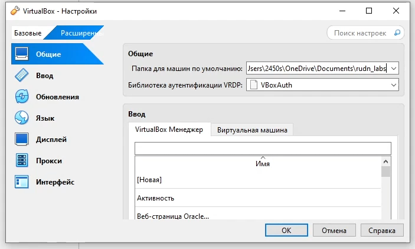{#fig:001 width=50%}

:::
::: {.column width="50%"}

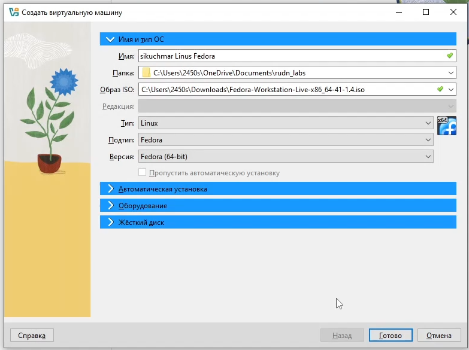{#fig:002 width=50%}

:::
::::::::::::::

## Запустим виртуальную машину

Выберем язык интерфейса. Место установки оставим по-умолчанию. Так же создадим имя пользователя и установим пароль 

:::::::::::::: {.columns align=center}
::: {.column width="50%"}

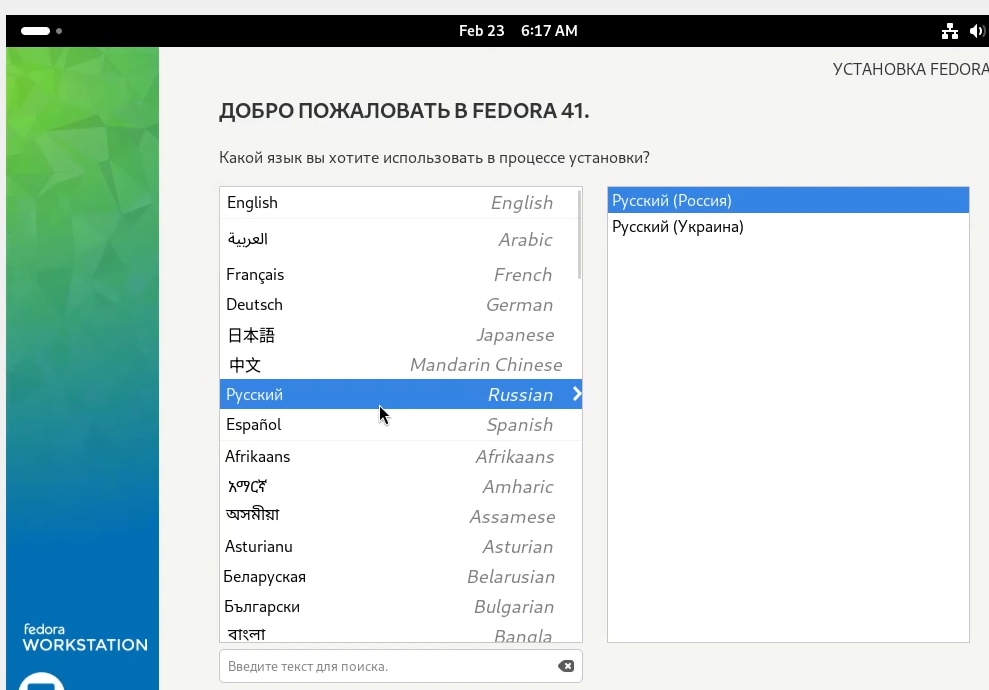{#fig:009 width=70%}

:::
::: {.column width="50%"}

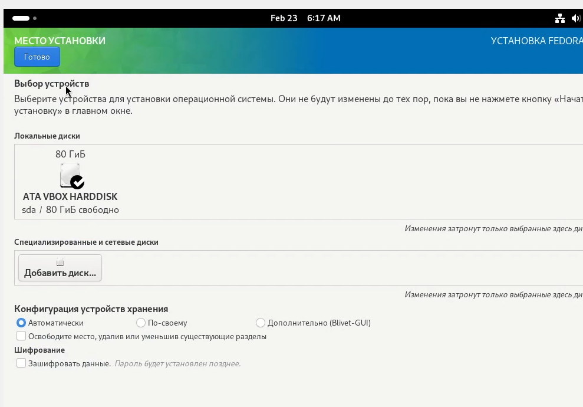{#fig:010 width=70%}

:::
::::::::::::::

## Обновление всех пакетов

Переключимся на роль супер-пользователя. Обновим все пакеты. 

:::::::::::::: {.columns align=center}
::: {.column width="50%"}

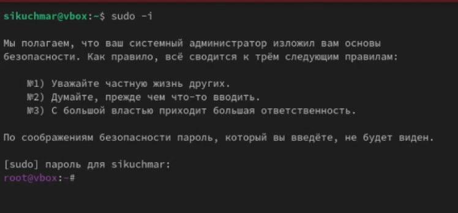{#fig:011 width=70%}

:::
::: {.column width="50%"}

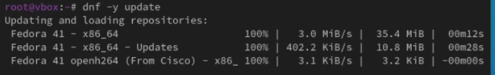{#fig:012 width=70%}

:::
::::::::::::::

## Автоматическое обновление

Установим программы для удобства работы в консоли. Для автоматического обновления установим программное обеспечение

:::::::::::::: {.columns align=center}
::: {.column width="50%"}

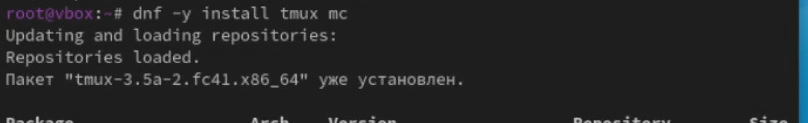{#fig:013 width=70%}

:::
::: {.column width="50%"}

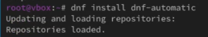{#fig:014 width=70%}

:::
::::::::::::::

## Отключение SELinux

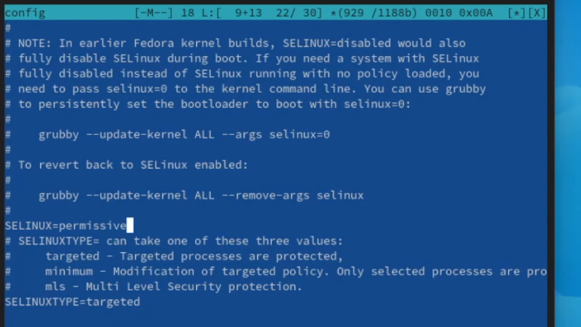{#fig:016 width=70%}

## Настройка раскладки клавиатуры

Создадим конфигурационный файл и отредактируем его.

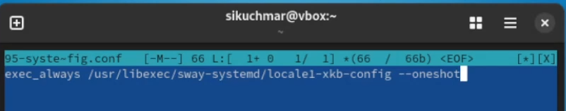{#fig:018 width=70%}

## Установка имени пользователя

Создадим пользователя и зададим пароль для пользователя

:::::::::::::: {.columns align=center}
::: {.column width="50%"}

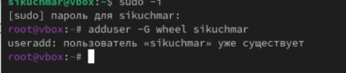{#fig:019 width=70%}

:::
::: {.column width="50%"}

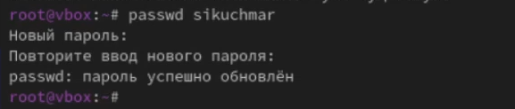{#fig:020 width=70%}

:::
::::::::::::::

## Установка названия хоста

Установим имя хоста и проверим, что имя хоста установлено верно

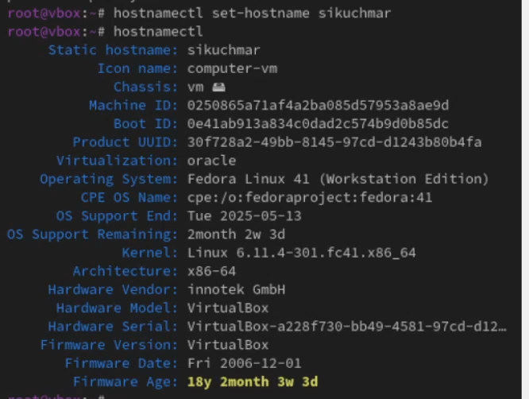{#fig:021 width=50%}

## Установка программного обеспечения для создания документации

Установим средство pandoc и pandoc-crossref для работы с языком разметки Markdown

:::::::::::::: {.columns align=center}
::: {.column width="50%"}

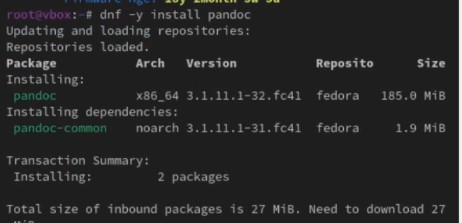{#fig:022 width=70%}

:::
::: {.column width="50%"}

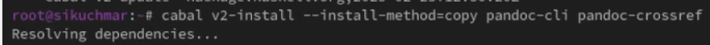{#fig:027 width=70%}

:::
::::::::::::::

## Установка texlive

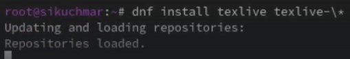{#fig:028 width=70%}

## Домашнее задание 

С помощью grep получим информацию о версии ядра Linux, частоте процессора и модели процессора

:::::::::::::: {.columns align=center}
::: {.column width="50%"}

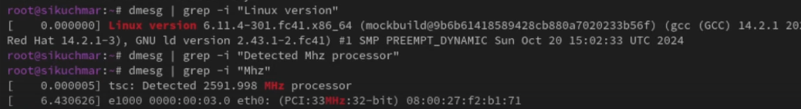{#fig:030 width=70%}

:::
::: {.column width="50%"}

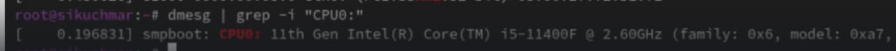{#fig:031 width=70%}

:::
::::::::::::::

## Домашнее задание 

С помощью grep получим информацию о объёме доступной оперативной памяти, типах обнаруженного гипервизора и файловой системы корневого раздела

:::::::::::::: {.columns align=center}
::: {.column width="50%"}

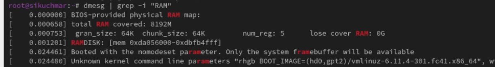{#fig:032 width=70%}

:::
::: {.column width="50%"}

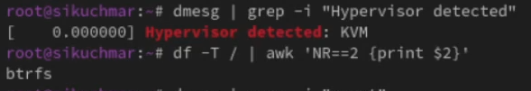{#fig:033 width=70%}

:::
::::::::::::::

# Результаты

## Выводы

- Успешно установлена и настроена Linux на Virtualbox.
-  Приобретены навыки установки ОС, базовой настройки и установки ПО (Markdown, TeX Live).
-  Создана готовая к использованию рабочая среда для разработки и документации.
-  Освоены командная строка и работа с пакетами.

## Спасибо за внимание

Спасибо за внимание
