---
## Front matter
title: "Лабораторная работа №1"
subtitle: "Операционные системы"
author: "Кучмар София Игоревна"

## Generic otions
lang: ru-RU
toc-title: "Содержание"

## Bibliography
bibliography: bib/cite.bib
csl: pandoc/csl/gost-r-7-0-5-2008-numeric.csl

## Pdf output format
toc: true # Table of contents
toc-depth: 2
lof: true # List of figures
lot: true # List of tables
fontsize: 12pt
linestretch: 1.5
papersize: a4
documentclass: scrreprt
## I18n polyglossia
polyglossia-lang:
  name: russian
  options:
	- spelling=modern
	- babelshorthands=true
polyglossia-otherlangs:
  name: english
## I18n babel
babel-lang: russian
babel-otherlangs: english
## Fonts
mainfont: IBM Plex Serif
romanfont: IBM Plex Serif
sansfont: IBM Plex Sans
monofont: IBM Plex Mono
mathfont: STIX Two Math
mainfontoptions: Ligatures=Common,Ligatures=TeX,Scale=0.94
romanfontoptions: Ligatures=Common,Ligatures=TeX,Scale=0.94
sansfontoptions: Ligatures=Common,Ligatures=TeX,Scale=MatchLowercase,Scale=0.94
monofontoptions: Scale=MatchLowercase,Scale=0.94,FakeStretch=0.9
mathfontoptions:
## Biblatex
biblatex: true
biblio-style: "gost-numeric"
biblatexoptions:
  - parentracker=true
  - backend=biber
  - hyperref=auto
  - language=auto
  - autolang=other*
  - citestyle=gost-numeric
## Pandoc-crossref LaTeX customization
figureTitle: "Рис."
tableTitle: "Таблица"
listingTitle: "Листинг"
lofTitle: "Список иллюстраций"
lotTitle: "Список таблиц"
lolTitle: "Листинги"
## Misc options
indent: true
header-includes:
  - \usepackage{indentfirst}
  - \usepackage{float} # keep figures where there are in the text
  - \floatplacement{figure}{H} # keep figures where there are in the text
---

# Цель работы

В рамках данной лабораторной работы мы приобретем практические навыки установки и настройки операционной системы Linux на виртуальную машину Virtualbox.

# Задание

В процессе выполнения лабораторной работы мы научимся устанавливать операционную систему на диск, запустив соответствующее приложение для установки. После установки мы проведем необходимые обновления, повысим комфорт работы с системой, настроим автоматическое обновление и отключим SELinux. Мы также настроим раскладку клавиатуры, установим имя пользователя и название хоста. В заключение, мы установим необходимое программное обеспечение для создания документации, а именно научимся работать с языком разметки Markdown и инсталлируем пакет texlive. В результате мы сделаем рабочее окружение для дальнейших исследований и разработок.

# Выполнение лабораторной работы

Проведём настройку папки в VirtualBox. В меню выберем Файл, Настройки. Выберем Общие, поле Папка для машин по умолчанию и зададим новое знчение (рис. [-@fig:001]).

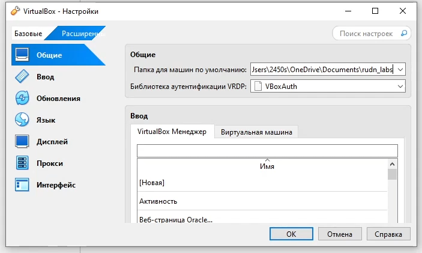{#fig:001 width=70%}

Создадим виртуальную машину. Выберем нужный iso, зададим имя, папку и тип (рис. [-@fig:002]).

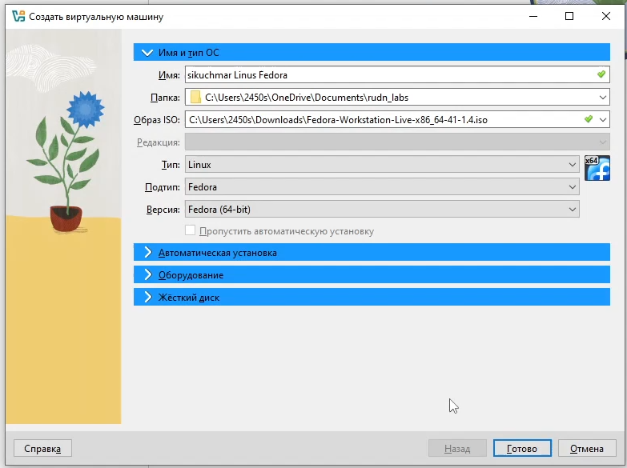{#fig:002 width=70%}

Укажем размер основной памяти виртуальной машины — от 2048 МБ (рис. [-@fig:003]).

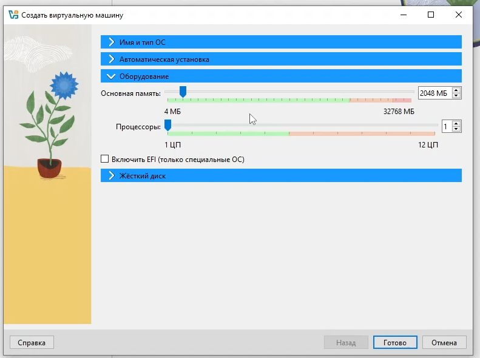{#fig:003 width=70%}

Зададим размер диска — 80 ГБ, его расположение (рис. [-@fig:004]).

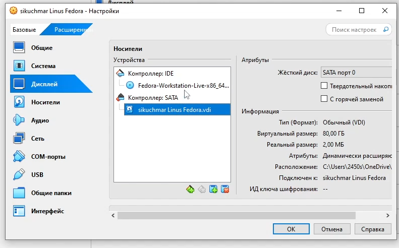{#fig:004 width=70%}

Включим двунаправленный общий буфер обмена и функцию Drag'n'Drop (рис. [-@fig:005]).

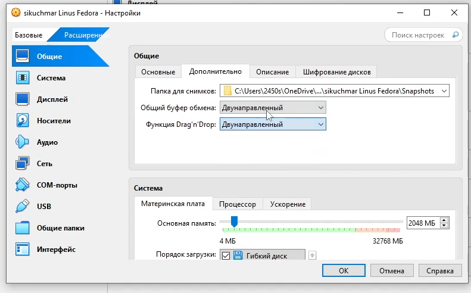{#fig:005 width=70%}

Включим поддержку UEFI (рис. [-@fig:006]).

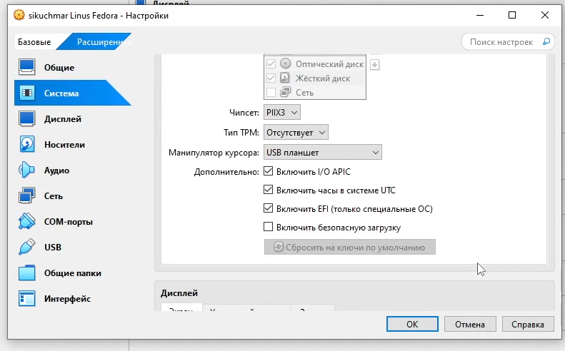{#fig:006 width=70%}

В качестве графического контроллера поставим VMSVGA и включим ускорение 3D (рис. [-@fig:007]).

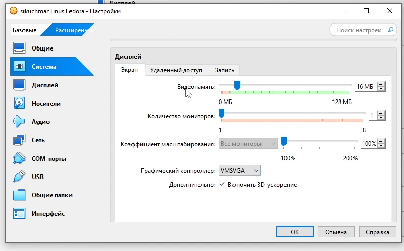{#fig:007 width=70%}

Добавим общую папку и сохраним (рис. [-@fig:008]).

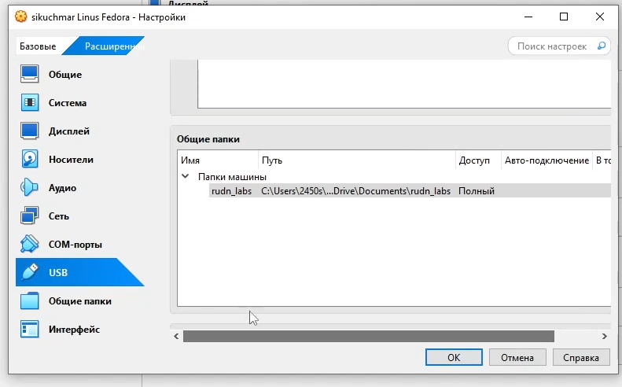{#fig:008 width=70%}

Запустим виртуальную машину. Выберем язык интерфейса (рис. [-@fig:009]).

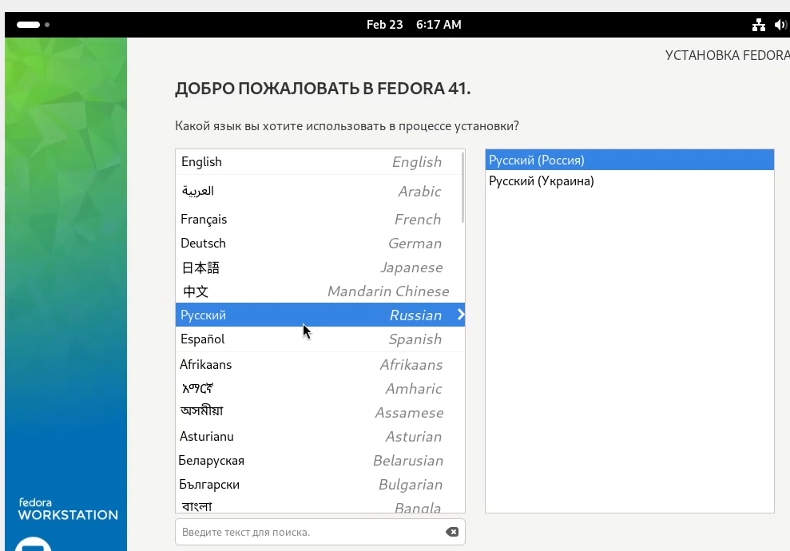{#fig:009 width=70%}

Место установки оставим по-умолчанию. Так же создадим имя пользователя и установим пароль (рис. [-@fig:010]).

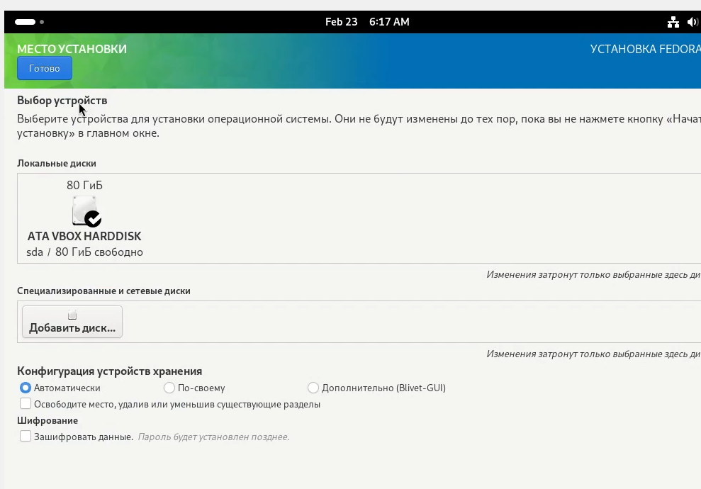{#fig:010 width=70%}

После установки переключимся на роль супер-пользователя (рис. [-@fig:011]).

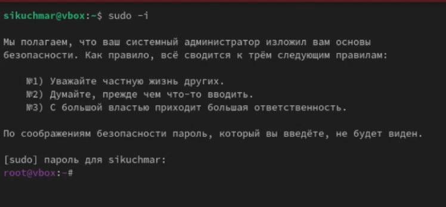{#fig:011 width=70%}

Обновим все пакеты (рис. [-@fig:012]).

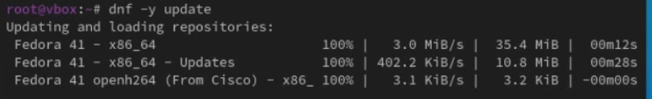{#fig:012 width=70%}

Установим программы для удобства работы в консоли (рис. [-@fig:013]).

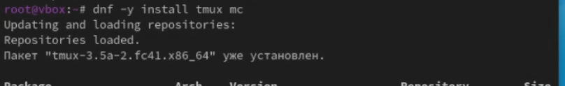{#fig:013 width=70%}

Для автоматического обновления установим программное обеспечение (рис. [-@fig:014]).

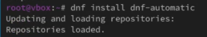{#fig:014 width=70%}

Запустим таймер (рис. [-@fig:015]).

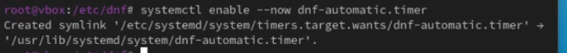{#fig:015 width=70%}

Отключение SELinux. В файле /etc/selinux/config заменим значение SELinux с enforcing на permissive (рис. [-@fig:016]).

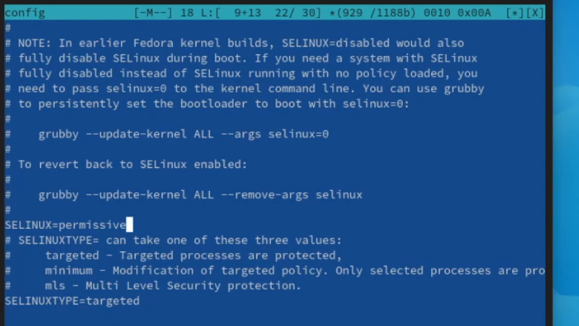{#fig:016 width=70%}

Настройка раскладки клавиатуры. Создадим конфигурационный файл ~/.config/sway/config.d/95-system-keyboard-config.conf (рис. [-@fig:017]).

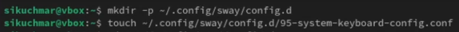{#fig:017 width=70%}

Отредактируем конфигурационный файл 95-system-keyboard-config.conf и /etc/X11/xorg.conf.d/00-keyboard.conf (рис. [-@fig:018]).

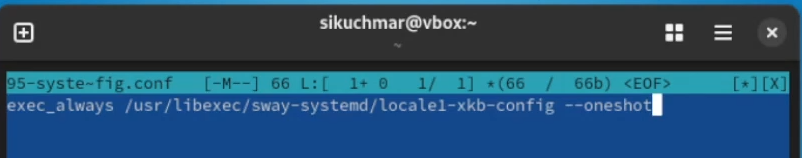{#fig:018 width=70%}

Установка имени пользователя и названия хоста. Создадим пользователя (рис. [-@fig:019]).

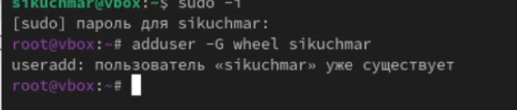{#fig:019 width=70%}

Зададим пароль для пользователя (рис. [-@fig:020]).

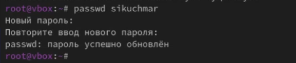{#fig:020 width=70%}

Установим имя хоста и проверим, что имя хоста установлено верно (рис. [-@fig:021]).

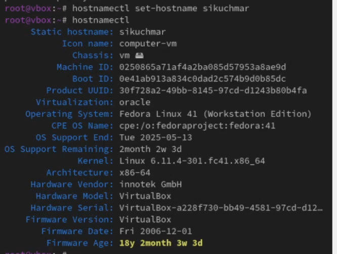{#fig:021 width=70%}

Установка программного обеспечения для создания документации. Работа с языком разметки Markdown. Установим средство pandoc для работы с языком разметки Markdown (рис. [-@fig:022]).

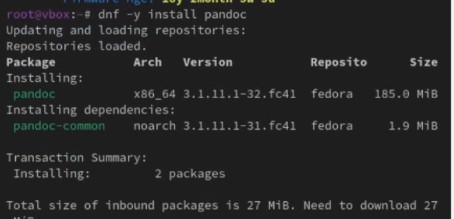{#fig:022 width=70%}

Установка ghcup (рис. [-@fig:023]).

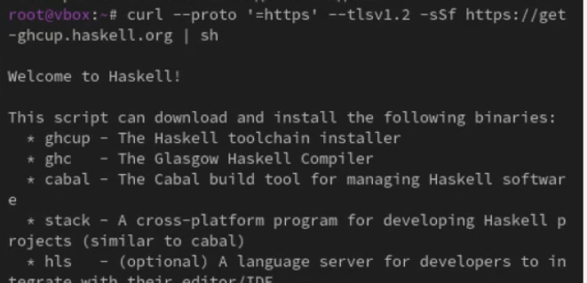{#fig:023 width=70%}

Установка ghc (рис. [-@fig:024]).

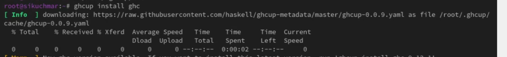{#fig:024 width=70%}

Установка cabal (рис. [-@fig:025]).

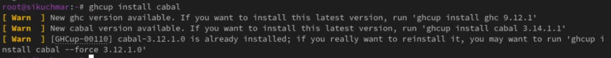{#fig:025 width=70%}

Обновление cabal (рис. [-@fig:026]).

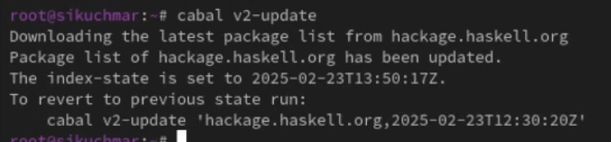{#fig:026 width=70%}

Установка pandoc-crossref (рис. [-@fig:027]).

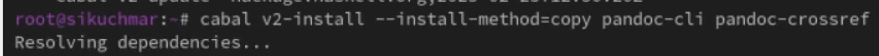{#fig:027 width=70%}

Установка texlive (рис. [-@fig:028]).

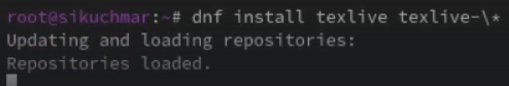{#fig:028 width=70%}

Проверим, что всё установилось (рис. [-@fig:029]).

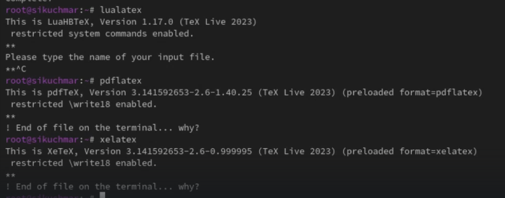{#fig:029 width=70%}

Домашнее задание. С помощью grep получим информацию о версии ядра Linux и частоте процессора (рис. [-@fig:030]).

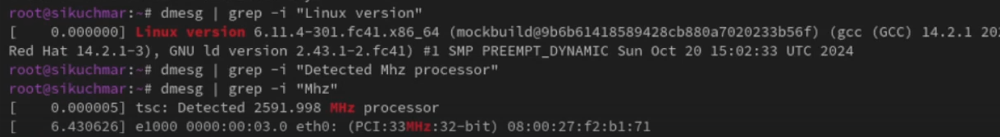{#fig:030 width=70%}

С помощью grep получим информацию о модели процессора (рис. [-@fig:031]).

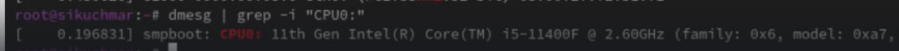{#fig:031 width=70%}

С помощью grep получим информацию о объёме доступной оперативной памяти (рис. [-@fig:032]).

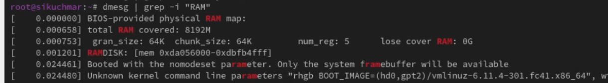{#fig:032 width=70%}

С помощью grep получим информацию о типах обнаруженного гипервизора и файловой системы корневого раздела (рис. [-@fig:033]).

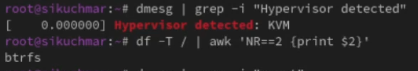{#fig:033 width=70%}

# Контрольные вопросы

Какую информацию содержит учётная запись пользователя?

- Имя пользователя (username): Уникальный идентификатор пользователя.
- Идентификатор пользователя (UID): Числовой идентификатор.
- Идентификатор группы (GID): Основная группа пользователя.
- Домашний каталог: Каталог, в котором пользователь хранит свои файлы.
- Оболочка (shell): Интерпретатор команд, используемый пользователем.
- Пароль (зашифрованный): Для аутентификации.
- Полное имя (GECOS): Дополнительная информация (имя, телефон и т.п.).

Укажите команды терминала и приведите примеры:

- Справка по команде: 
    - man <команда> (например, man ls)
    - <команда> --help (например, ls --help)
- Перемещение по файловой системе:
    - cd <путь> (например, cd /home/user/Documents)
    - cd .. (на уровень выше)
    - cd ~ (в домашний каталог)
- Просмотр содержимого каталога:
    - ls (простой список)
    - ls -l (подробный список)
    - ls -a (включая скрытые файлы)
- Определение объёма каталога:
    - du -sh <каталог> (например, du -sh /home/user)
- Создание / удаление каталогов / файлов:
    - mkdir <каталог> (создать каталог)
    - rmdir <каталог> (удалить пустой каталог)
    - touch <файл> (создать пустой файл)
    - rm <файл> (удалить файл)
    - rm -r <каталог> (удалить каталог с содержимым)
- Задание прав на файл / каталог:
    - chmod <права> <файл/каталог> (например, chmod 755 script.sh)
- Просмотр истории команд:
    - history

Что такое файловая система? Приведите примеры с краткой характеристикой.

Файловая система - способ организации и хранения файлов на диске.
- ext4: Журналируемая файловая система, стандартная для Linux.  Надёжная, быстрая.
- NTFS: Используется в Windows.  Поддерживает права доступа, журналирование.
- FAT32: Устаревшая, но совместимая с многими ОС. Ограничение на размер файла (4 ГБ).
- XFS:  Производительная, хорошо подходит для больших файлов.

Как посмотреть, какие файловые системы подмонтированы в ОС?
- df -h
- mount

Как удалить зависший процесс?
1.  Найти PID (идентификатор процесса): ps aux | grep <имя процесса> или top.
2.  Удалить процесс: kill <PID> (мягкое завершение) или kill -9 <PID> (принудительное завершение).

# Выводы

В рамках лабораторной работы мы установили Linux на Virtualbox, получив практические навыки по установке ОС на диск, запуску инсталлятора, проведению обновлений, повышению удобства работы, настройке автоматического обновления, отключению SELinux, настройке раскладки клавиатуры, установке имени пользователя и хоста, а также установке необходимого ПО для работы с Markdown и пакета texlive, что позволит создать полноценное рабочее окружение для дальнейших исследований и разработок.

