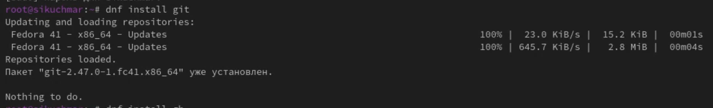

---
## Front matter
lang: ru-RU
title: Лабораторная работа №2
subtitle: Первоначальна настройка git
author:
  - Кучмар С. И.
institute:
  - НММ-02-24
date: 05 марта 2024

## i18n babel
babel-lang: russian
babel-otherlangs: english

## Formatting pdf
toc: false
toc-title: Содержание
slide_level: 2
aspectratio: 169
section-titles: true
theme: metropolis
header-includes:
 - \metroset{progressbar=frametitle,sectionpage=progressbar,numbering=fraction}
---

# Информация

## Докладчик

:::::::::::::: {.columns align=center}
::: {.column width="70%"}

  * Кучмар София Игоревна
  * Аналитик данных
  * Студент факультета физико-математических и естественных наук
  * Российский университет дружбы народов
  * [1132246765@pfur.ru](mailto:1132246765@pfur.ru)

:::
::: {.column width="30%"}

:::
::::::::::::::

# Вводная часть

## Актуальность

Актуальность работы обусловлена необходимостью владения Git и GitHub для современной разработки. Работа учит безопасной настройке окружения, автоматизации задач через GitHub CLI и организации рабочего процесса, что критически важно для продуктивной командной работы и конкурентоспособности на рынке труда.

## Объект и предмет исследования

- Система контроля версий Git и платформа GitHub.
- Процесс настройки окружения разработки, включающий установку и конфигурацию Git и GitHub CLI (gh), генерацию и настройку SSH и PGP ключей, а также создание шаблона рабочего пространства и репозитория курса на GitHub.

## Цели и задачи

- Установить, настроить Git и GitHub CLI (gh), сгенерировать и настроить SSH и PGP ключи для безопасной аутентификации на GitHub.
- Разработать шаблон рабочего пространства, создать репозиторий курса на GitHub и настроить структуру каталогов для организации файлов проекта.

## Материалы и методы

1. Установка ПО: Использование менеджера пакетов (например, apt, brew, choco) для установки Git и GitHub CLI (gh).
2.  Конфигурирование: Командная строка и редактирование конфигурационных файлов Git для настройки имени пользователя, электронной почты и других параметров. Использование команд gh для аутентификации и настройки GitHub CLI.
3. Генерация и настройка: Использование командной строки для генерации SSH и PGP ключей. Добавление SSH ключа в учетную запись GitHub. Настройка подписи коммитов с использованием PGP ключа
4. Тестирование: Создание локального репозитория, выполнение коммитов, отправка изменений на GitHub. Проверка корректности подписи коммитов. Создание репозитория из шаблона рабочего пространства.

# Выполнение работы

## Установка программного обеспечения

Проведём установку программного обеспечения. Установим Git и gh.

:::::::::::::: {.columns align=center}
::: {.column width="50%"}

{#fig:001 width=70%}

:::
::: {.column width="50%"}

{#fig:002 width=70%}

:::
::::::::::::::

## Базовая настройка git

Зададим имя и email владельца репозитория. Настроим utf-8 в выводе сообщений git. Зададим имя начальной ветки (будем называть её master). Установим параметр autocrlf и safecrlf. 

{#fig:003 width=70%}

## Создание ключей ssh

Сгенерируем ключи по алгоритму RSA с ключом размером 4096 бит и по алгоритму ed25519.

:::::::::::::: {.columns align=center}
::: {.column width="50%"}

{#fig:004 width=70%}

:::
::: {.column width="50%"}

{#fig:005 width=70%}

:::
::::::::::::::

## Создайте ключи pgp

Сгенерируем PGP ключ и добавим его в наш github

:::::::::::::: {.columns align=center}
::: {.column width="50%"}

{#fig:006 width=70%}

:::
::: {.column width="50%"}

{#fig:007 width=70%}

:::
::::::::::::::

## Настройка автоматических подписей коммитов git

Используя введённый email, укажем Git применять его при подписи коммитов

{#fig:008 width=70%}

## Настройка gh

{#fig:009 width=70%}

## Сознание репозитория курса на основе шаблона

Необходимо создать шаблон рабочего пространства. Для этого создадим папку, перейдём туда и создадим репозиторий и склонируем туда шаблон

:::::::::::::: {.columns align=center}
::: {.column width="50%"}

{#fig:011 width=70%}

:::
::: {.column width="50%"}

{#fig:012 width=70%}

:::
::::::::::::::

## Настройка каталога курса

Перейдем в каталог курса. Удалим лишние файлы и создадим необходимые каталоги

{#fig:013 width=70%}

## Отправим файлы на сервер

:::::::::::::: {.columns align=center}
::: {.column width="50%"}

{#fig:014 width=70%}

:::
::: {.column width="50%"}

{#fig:015 width=70%}

:::
::::::::::::::

# Результаты

## Выводы

- Успешно настроено безопасное окружение разработки с использованием Git и GitHub.
- Автоматизированы рутинные задачи с помощью GitHub CLI (gh).
- Создан шаблон рабочего пространства для эффективной организации проектов.
- Получены навыки, необходимые для контроля версий, совместной работы и управления проектами на GitHub.

## Спасибо за внимание

Спасибо за внимание
