---
## Front matter
title: "Лабораторная работа №2"
subtitle: "Операционные системы"
author: "Кучмар София Игоревна"

## Generic otions
lang: ru-RU
toc-title: "Содержание"

## Bibliography
bibliography: bib/cite.bib
csl: pandoc/csl/gost-r-7-0-5-2008-numeric.csl

## Pdf output format
toc: true # Table of contents
toc-depth: 2
lof: true # List of figures
lot: true # List of tables
fontsize: 12pt
linestretch: 1.5
papersize: a4
documentclass: scrreprt
## I18n polyglossia
polyglossia-lang:
  name: russian
  options:
	- spelling=modern
	- babelshorthands=true
polyglossia-otherlangs:
  name: english
## I18n babel
babel-lang: russian
babel-otherlangs: english
## Fonts
mainfont: IBM Plex Serif
romanfont: IBM Plex Serif
sansfont: IBM Plex Sans
monofont: IBM Plex Mono
mathfont: STIX Two Math
mainfontoptions: Ligatures=Common,Ligatures=TeX,Scale=0.94
romanfontoptions: Ligatures=Common,Ligatures=TeX,Scale=0.94
sansfontoptions: Ligatures=Common,Ligatures=TeX,Scale=MatchLowercase,Scale=0.94
monofontoptions: Scale=MatchLowercase,Scale=0.94,FakeStretch=0.9
mathfontoptions:
## Biblatex
biblatex: true
biblio-style: "gost-numeric"
biblatexoptions:
  - parentracker=true
  - backend=biber
  - hyperref=auto
  - language=auto
  - autolang=other*
  - citestyle=gost-numeric
## Pandoc-crossref LaTeX customization
figureTitle: "Рис."
tableTitle: "Таблица"
listingTitle: "Листинг"
lofTitle: "Список иллюстраций"
lotTitle: "Список таблиц"
lolTitle: "Листинги"
## Misc options
indent: true
header-includes:
  - \usepackage{indentfirst}
  - \usepackage{float} # keep figures where there are in the text
  - \floatplacement{figure}{H} # keep figures where there are in the text
---

# Цель работы

В рамках данной лабораторной работы мы выполним установку необходимого программного обеспечения, а именно установим Git и GitHub CLI (gh). 

# Задание

В процессе выполнения лабораторной работы мы произведем базовую настройку Git, сгенерируем SSH и PGP ключи для безопасной аутентификации. После этого мы настроим GitHub, добавив сгенерированный PGP ключ в нашу учетную запись и настроив автоматические подписи коммитов Git. Затем мы произведем настройку GitHub CLI (gh) для удобной работы с репозиториями. В завершение, мы создадим шаблон для рабочего пространства, создадим репозиторий курса на основе этого шаблона и настроим каталог курса для организации файлов. В итоге мы получим полностью настроенное окружение для контроля версий и совместной работы с кодом на платформе GitHub.

# Выполнение лабораторной работы

Проведём установку программного обеспечения. Установим Git (рис. [-@fig:001]).

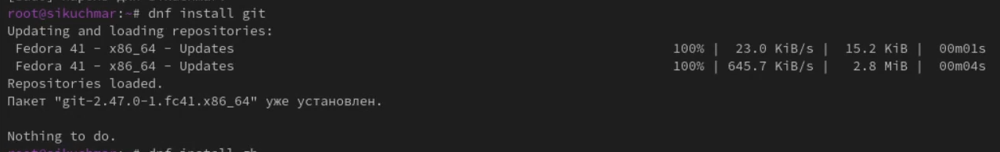{#fig:001 width=70%}

Установим gh (рис. [-@fig:002]).

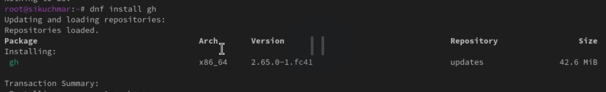{#fig:002 width=70%}

Зададим имя и email владельца репозитория. Настроим utf-8 в выводе сообщений git. Зададим имя начальной ветки (будем называть её master). Установим параметр autocrlf и safecrlf (рис. [-@fig:003]).

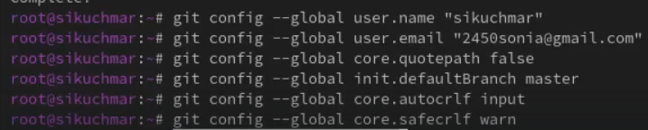{#fig:003 width=70%}

Сгенерируем ключи по алгоритму RSA с ключом размером 4096 бит (рис. [-@fig:004]).

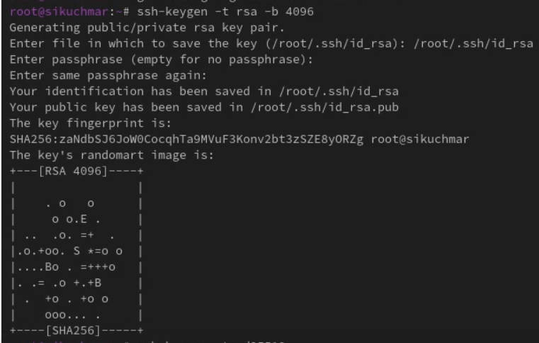{#fig:004 width=70%}

Сгенерируем ключи по алгоритму ed25519 (рис. [-@fig:005]).

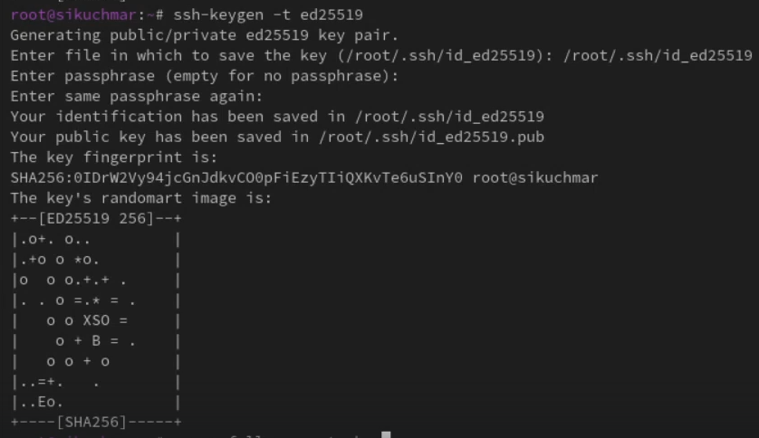{#fig:005 width=70%}

Сгенерируем PGP ключ (рис. [-@fig:006]).

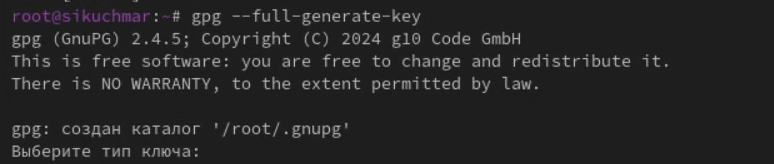{#fig:006 width=70%}

Добавим его в наш github (рис. [-@fig:007]).

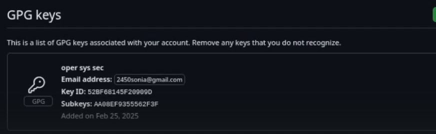{#fig:007 width=70%}

Настройка автоматических подписей коммитов Git. Используя введённый email, укажем Git применять его при подписи коммитов (рис. [-@fig:008]).

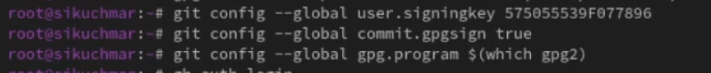{#fig:008 width=70%}

Для начала авторизуемся (рис. [-@fig:009]).

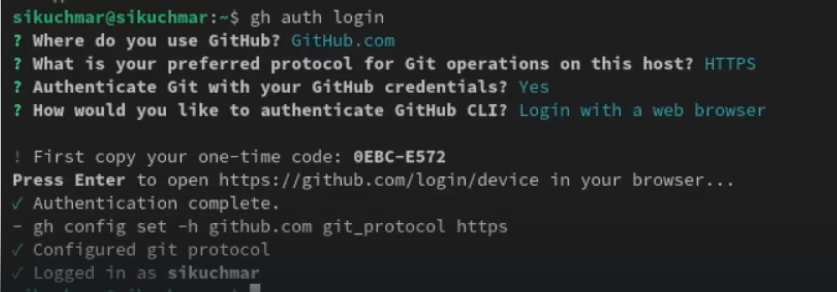{#fig:009 width=70%}

Необходимо создать шаблон рабочего пространства. Для этого создадим папку (рис. [-@fig:010]).

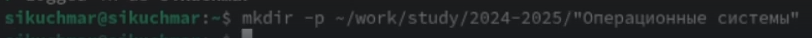{#fig:010 width=70%}

Перейдём туда и создадим репозиторий (рис. [-@fig:011]).

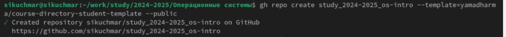{#fig:011 width=70%}

После склонируем репозиторий (рис. [-@fig:012]).

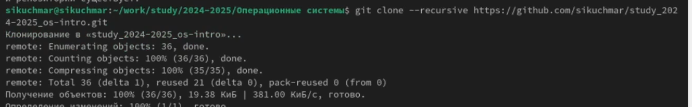{#fig:012 width=70%}

Перейдем в каталог курса. Удалим лишние файлы и создадим необходимые каталоги (рис. [-@fig:013]).

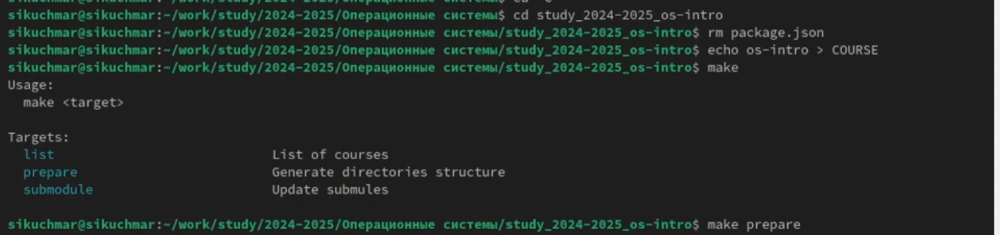{#fig:013 width=70%}

Отправим файлы на сервер (рис. [-@fig:014]) и (рис. [-@fig:015]).

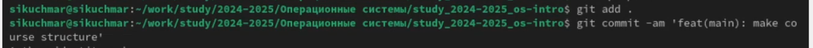{#fig:014 width=70%}

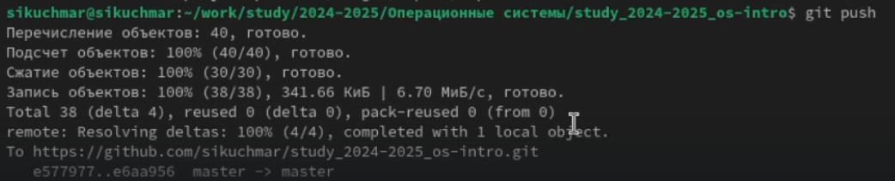{#fig:015 width=70%}

# Контрольные вопросы

Что такое системы контроля версий (VCS) и для решения каких задач они предназначаются?:

- VCS: Инструменты для отслеживания изменений файлов во времени.
- Задачи: Отслеживание, возврат, сравнение версий, совместная работа, ветвление, резервное копирование.

Объясните следующие понятия VCS и их отношения: хранилище, commit, история, рабочая копия.

- Хранилище: Все версии проекта + история.
- Commit: Снимок состояния проекта в момент времени.
- История: Последовательность коммитов.
- Рабочая копия: Локальная копия для работы.

Что представляют собой и чем отличаются централизованные и децентрализованные VCS? Приведите примеры VCS каждого вида.

- Централизованные: Единое хранилище (SVN, CVS).
- Децентрализованные: Полная копия хранилища у каждого (Git, Mercurial).

Опишите действия с VCS при единоличной работе с хранилищем.

1. Создать/Клонировать.
2. Изменить.
3. Проверить.
4. Добавить в индекс.
5. Закоммитить.
6. (Push для удаленного).

Опишите порядок работы с общим хранилищем VCS.

1. Клонировать.
2. Создать ветку.
3. Изменить.
4. Проверить.
5. Добавить в индекс.
6. Закоммитить.
7. Push.
8. Pull Request.
9. Ревью.
10. Слияние.
11. Удалить ветку.
12. Pull.

Каковы основные задачи, решаемые инструментальным средством git?

- Версионный контроль, совместная работа, управление ветками, отслеживание изменений, разрешение конфликтов, возврат к версиям.

Назовите и дайте краткую характеристику командам git.

- git init: Создать репо локально.
- git clone: Скачать репо удаленно.
- git add: Добавить в индекс сейчас.
- git commit: Зафиксировать изменения локально.
- git push: Отправить на сервер вверх.
- git pull: Получить с сервера вниз.
- git status: Состояние сейчас показывает.
- git log: История коммитов отображается.
- git branch: Ветки создать, переключить.
- git checkout: Переключиться между ветками.
- git merge: Объединить ветки вместе.
- git diff: Различия файлы покажет.

Приведите примеры использования при работе с локальным и удалённым репозиториями

- (Локально): git init, git add file.txt, git commit -m "Initial", git log.
- (Удаленно): git clone URL, git remote add origin URL, git push origin main, git pull origin main.

Что такое и зачем могут быть нужны ветви (branches)?

- Независимые линии разработки.
- Нужны для: параллельной работы, экспериментов, разделения задач.

Как и зачем можно игнорировать некоторые файлы при commit?

- Исключение из коммитов временных, конфиденциальных и больших файлов.
- Сокращение размера репозитория и предотвращение конфликтов.

# Выводы

В ходе выполнения лабораторной работы было успешно создано и настроено окружение для эффективной работы с системой контроля версий Git и платформой GitHub. В частности, были выполнены следующие задачи:

- Установлены необходимые инструменты: Git и GitHub CLI (gh).
- Выполнена базовая настройка Git и сгенерированы ключи SSH и PGP для безопасной аутентификации.
- Настроен аккаунт GitHub с добавлением PGP-ключа и включены автоматические подписи коммитов.
- Настроен GitHub CLI для удобного взаимодействия с репозиториями.
- Создан шаблон рабочего пространства, создан на его основе репозиторий курса и настроена структура каталогов для организации файлов.

В результате получено полностью готовое к использованию окружение для контроля версий и совместной разработки кода на платформе GitHub.

