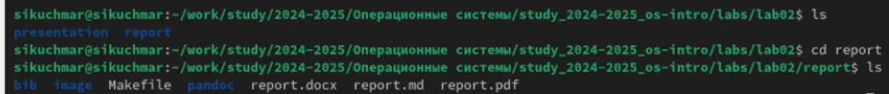

---
## Front matter
lang: ru-RU
title: Лабораторная работа №3
subtitle: Markdown
author:
  - Кучмар С. И.
institute:
  - НММ-02-24
date: 05 марта 2024

## i18n babel
babel-lang: russian
babel-otherlangs: english

## Formatting pdf
toc: false
toc-title: Содержание
slide_level: 2
aspectratio: 169
section-titles: true
theme: metropolis
header-includes:
 - \metroset{progressbar=frametitle,sectionpage=progressbar,numbering=fraction}
---

# Информация

## Докладчик

:::::::::::::: {.columns align=center}
::: {.column width="70%"}

  * Кучмар София Игоревна
  * Аналитик данных
  * Студент факультета физико-математических и естественных наук
  * Российский университет дружбы народов
  * [1132246765@pfur.ru](mailto:1132246765@pfur.ru)

:::
::: {.column width="30%"}

:::
::::::::::::::

# Вводная часть

## Актуальность

Актуальность изучения Markdown обусловлена его широким применением для структурирования документов в программировании и веб-разработке. Освоение Markdown позволяет эффективно оформлять отчеты и документацию, обеспечивая простоту чтения и редактирования. Эти навыки необходимы для создания качественных текстовых материалов и являются ценными для специалистов.

## Объект и предмет исследования

- Язык разметки Markdown.
- Методы и приемы использования Markdown для создания структурированных и читаемых документов.

## Цели и задачи

- Изучить базовый синтаксис Markdown и освоить основные элементы форматирования текста.
- Приобрести практические навыки применения Markdown для создания различных типов документов (отчеты, документация, статьи).

## Материалы и методы

1.  Изучение: Анализ документации и примеров для освоения синтаксиса Markdown.
2.  Практика: Создание и редактирование Markdown-документов различной сложности.
3.  Эксперимент: Применение различных элементов форматирования и изучение их влияния на отображение документа.
4.  Сравнение: Оценка различных редакторов Markdown с точки зрения удобства использования и функциональности.

# Выполнение работы

## Подготовка в созданию отчёта

Откроем терминал и перейдём в каталог курса сформированный при выполнении лабораторной работы №2, перенесём туда файлы из шаблона. Удалим файлы report.pdf и report.docx.

:::::::::::::: {.columns align=center}
::: {.column width="50%"}

{#fig:101 width=70%}

:::
::: {.column width="50%"}

{#fig:102 width=70%}

:::
::::::::::::::

## Создание отчёта

Откроем файл report.md c помощью mc в терминале. В соответствующем каталоге сделаем отчёт по лабораторной работе № 2 в формате Markdown.

:::::::::::::: {.columns align=center}
::: {.column width="50%"}

{#fig:103 width=70%}

:::
::: {.column width="50%"}

{#fig:104 width=70%}

:::
::::::::::::::

## Завершение

Выполним команду make, чтобы сформировать pdf и docx. Загрузим файлы на Github.

:::::::::::::: {.columns align=center}
::: {.column width="50%"}

{#fig:105 width=70%}

:::
::: {.column width="50%"}

{#fig:106 width=70%}

:::
::::::::::::::

# Результаты

## Выводы

- Освоен базовый синтаксис Markdown и основные элементы форматирования текста.
- Приобретены практические навыки создания различных типов документов с использованием Markdown.
- Изучены возможности применения Markdown для структурирования информации и улучшения читаемости документов.
- Получено представление о различных инструментах для работы с Markdown (текстовые редакторы, онлайн-редакторы).
- Сформировано понимание преимуществ Markdown как простого и эффективного языка разметки для создания текстовых материалов.

## Спасибо за внимание

Спасибо за внимание
