---
## Front matter
lang: ru-RU
title: Лабораторная работа №7
subtitle: Анализ файловой системы Linux. Команды для работы с файлами и каталогами
author:
  - Кучмар С. И.
institute:
  - НММ-02-24
date: 29 марта 2025

## i18n babel
babel-lang: russian
babel-otherlangs: english

## Formatting pdf
toc: false
toc-title: Содержание
slide_level: 2
aspectratio: 169
section-titles: true
theme: metropolis
header-includes:
 - \metroset{progressbar=frametitle,sectionpage=progressbar,numbering=fraction}
---

# Информация

## Докладчик

:::::::::::::: {.columns align=center}
::: {.column width="70%"}

  * Кучмар София Игоревна
  * Аналитик данных
  * Студент факультета физико-математических и естественных наук
  * Российский университет дружбы народов
  * [1132246765@pfur.ru](mailto:1132246765@pfur.ru)

:::
::: {.column width="30%"}

:::
::::::::::::::

# Вводная часть

## Цели и задачи

- Ознакомление с файловой системой Linux.
- Приобретение практических навыков по применению команд для работы
с файлами и каталогами

# Выполнение работы

## Копирование файлов

Выполним копирование файла в текущем каталоге. Скопируем файл ~/abc1 в файл april и в файл may. Выполним копирование нескольких файлов в каталог. Скопируем файлы april и may в каталог monthly. Выполним копирование файлов в произвольном каталоге. Скопируем файл monthly/may в файл с именем june.

:::::::::::::: {.columns align=center}
::: {.column width="30%"}

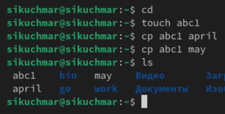{#fig:001 width=100%}

:::
::: {.column width="30%"}

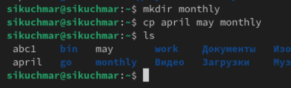{#fig:002 width=100%}

:::
::: {.column width="30%"}

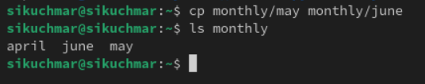{#fig:003 width=100%}

:::
::::::::::::::

## Копирование каталогов

Выполним копирование каталогов в текущем каталоге. Скопировать каталог monthly в каталог monthly.00. Выполним копирование каталогов в произвольном каталоге. Скопировать каталог monthly.00 в каталог /tmp.

:::::::::::::: {.columns align=center}
::: {.column width="50%"}

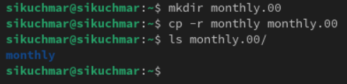{#fig:004 width=100%}

:::
::: {.column width="50%"}

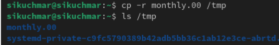{#fig:005 width=100%}

:::
::::::::::::::

##  Перемещение и переименование файлов

Выполним переименование файлов в текущем каталоге. Изменим название файла april на july в домашнем каталоге. Выполним перемещение файлов в другой каталог. Переместим файл july в каталог monthly.00.

:::::::::::::: {.columns align=center}
::: {.column width="50%"}

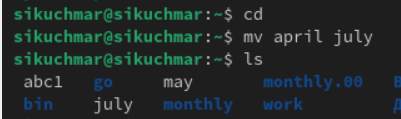{#fig:006 width=100%}

:::
::: {.column width="50%"}

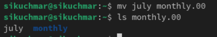{#fig:007 width=100%}

:::
::::::::::::::

##  Перемещение и переименование каталогов

Выполним переименование каталогов в текущем каталоге. Переименуем каталог monthly.00 в monthly.01. Выполним перемещение каталога в другой каталог. Переместим каталог monthly.01в каталог reports. Выполним переименование каталога, не являющегося текущим. Переименуем каталог reports/monthly.01 в reports/monthly.

:::::::::::::: {.columns align=center}
::: {.column width="30%"}

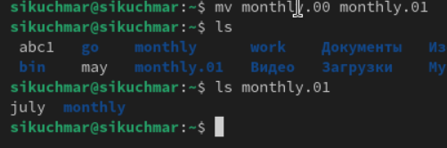{#fig:008 width=100%}

:::
::: {.column width="30%"}

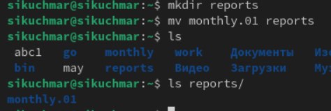{#fig:009 width=100%}

:::
::: {.column width="30%"}

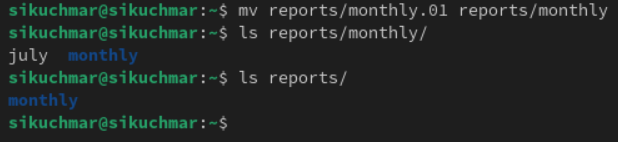{#fig:010 width=100%}

:::
::::::::::::::

## Права доступа

Создадим файл ~/may с правом выполнения для владельца. Лишим владельца файла ~/may права на выполнение. Создадим каталог monthly с запретом на чтение для членов группы и всех остальных пользователей. Создадим файл ~/abc1 с правом записи для членов группы.

:::::::::::::: {.columns align=center}
::: {.column width="25%"}

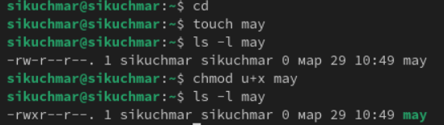{#fig:011 width=100%}

:::
::: {.column width="25%"}

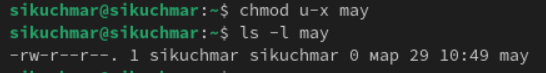{#fig:012 width=100%}

:::
::: {.column width="25%"}

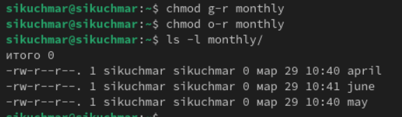{#fig:013 width=100%}

:::
::: {.column width="25%"}

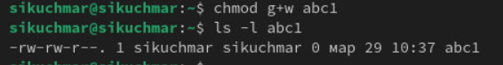{#fig:014 width=100%}

:::
::::::::::::::

## Создание файла equipment

Скопируем файл /usr/include/sys/io.h в домашний каталог и назовём его equipment. В домашнем каталоге создадим директорию ~/ski.plases. Переместим файл equipment в этот каталог

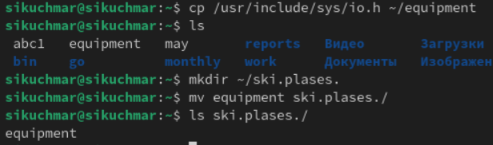{#fig:015 width=100%}

## Работа с equiplist

Переименуем файл ~/ski.plases/equipment в ~/ski.plases/equiplist. Скопируем abc1 в каталог ~/ski.plases, назовите его equiplist2.

:::::::::::::: {.columns align=center}
::: {.column width="50%"}

{#fig:016 width=100%}

:::
::: {.column width="50%"}

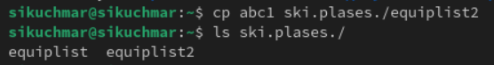{#fig:017 width=100%}

:::
::::::::::::::

## Перемещение файлов

Создадим каталог с именем equipment в каталоге ~/ski.plases. Переместите файлы ~/ski.plases/equiplist и equiplist2 в каталог
~/ski.plases/equipment. Создадим и переместим каталог ~/newdir в каталог ~/ski.plases и назовите его plans.

:::::::::::::: {.columns align=center}
::: {.column width="50%"}

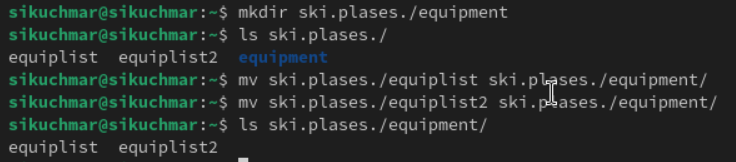{#fig:018 width=100%}

:::
::: {.column width="50%"}

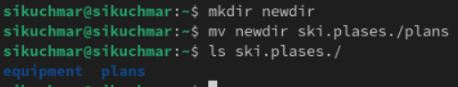{#fig:019 width=100%}

:::
::::::::::::::

## Присвоение прав доступа

С помощью команды chmod присвоим необходимые права доступа

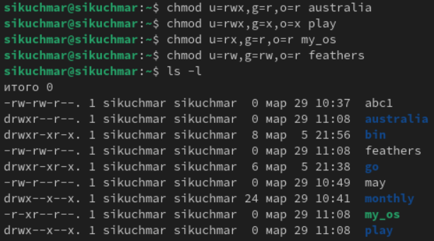{#fig:020 width=70%}

## Работа с файлами

Скопируем файл ~/feathers в файл ~/file.old. Переместим файл ~/file.old в каталог ~/play. Скопируем каталог ~/play в каталог ~/fun. Переместим каталог ~/fun в каталог ~/play и назовём его games.

:::::::::::::: {.columns align=center}
::: {.column width="30%"}

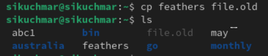{#fig:021 width=100%}

:::
::: {.column width="30%"}

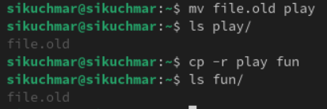{#fig:022 width=100%}

:::
::: {.column width="30%"}

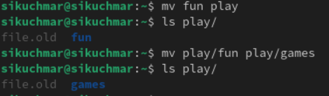{#fig:023 width=100%}

:::
::::::::::::::

## Проверка изменений прав доступа

Лишим владельца файла ~/feathers права на чтение. Попытаемся просмотреть файл ~/feathers командой cat и скопировать его. Дадим владельцу файла ~/feathers право на чтение. Лишим владельца каталога ~/play права на выполнение. Попытаемся перейти в каталог ~/play. Дадим владельцу каталога ~/play право на выполнение.

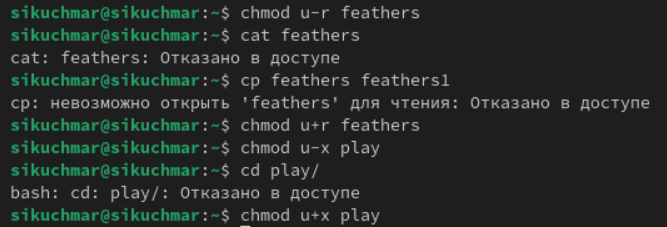{#fig:024 width=70%}

## Файловые системы

Прочитаем man по командам mount, fsck, mkfs, kill.

:::::::::::::: {.columns align=center}
::: {.column width="50%"}

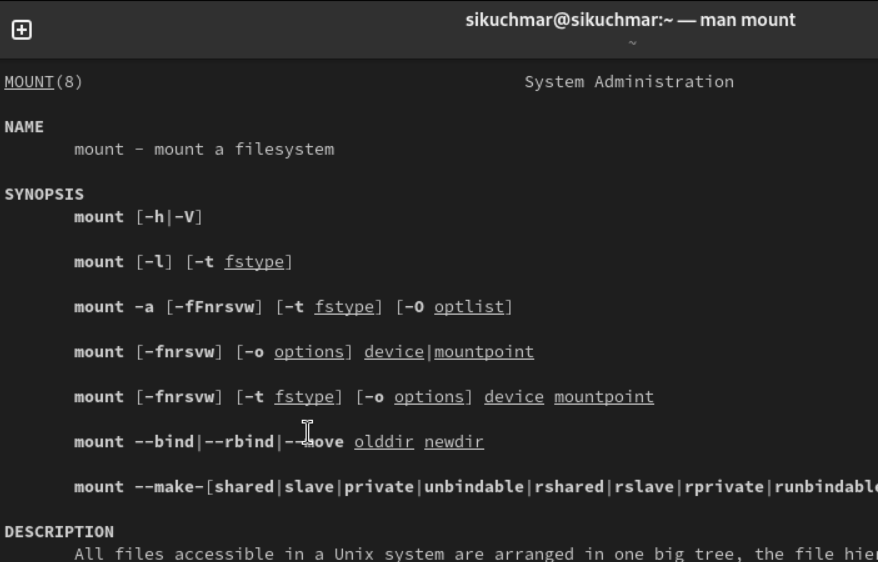{#fig:025 width=100%}

:::
::: {.column width="50%"}

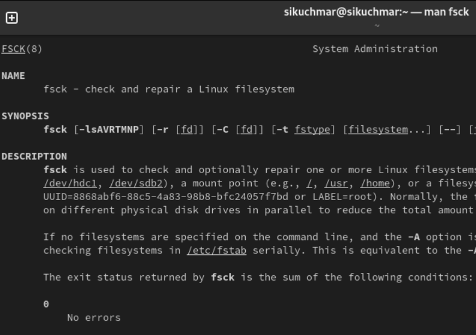{#fig:026 width=100%}

:::
::::::::::::::

## Файловые системы

Прочитаем man по командам mount, fsck, mkfs, kill.

:::::::::::::: {.columns align=center}
::: {.column width="50%"}

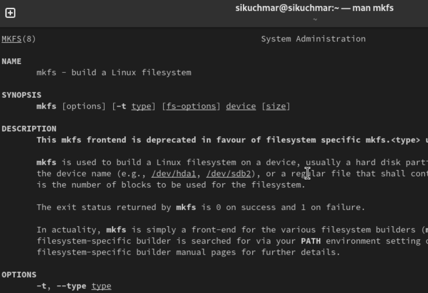{#fig:027 width=100%}

:::
::: {.column width="50%"}

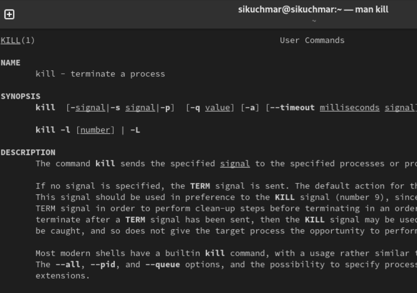{#fig:028 width=100%}

:::
::::::::::::::

# Результаты

## Выводы

- Успешно ознакомлены с файловой системой Linux, её структурой
- Приобретены практических навыков по применению команд для работы с файлами и каталогами

## Спасибо за внимание

Спасибо за внимание
