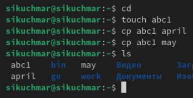

---
## Front matter
title: "Лабораторная работа №7"
subtitle: "Операционные системы"
author: "Кучмар София Игоревна"

## Generic otions
lang: ru-RU
toc-title: "Содержание"

## Bibliography
bibliography: bib/cite.bib
csl: pandoc/csl/gost-r-7-0-5-2008-numeric.csl

## Pdf output format
toc: true # Table of contents
toc-depth: 2
lof: true # List of figures
lot: true # List of tables
fontsize: 12pt
linestretch: 1.5
papersize: a4
documentclass: scrreprt
## I18n polyglossia
polyglossia-lang:
  name: russian
  options:
	- spelling=modern
	- babelshorthands=true
polyglossia-otherlangs:
  name: english
## I18n babel
babel-lang: russian
babel-otherlangs: english
## Fonts
mainfont: IBM Plex Serif
romanfont: IBM Plex Serif
sansfont: IBM Plex Sans
monofont: IBM Plex Mono
mathfont: STIX Two Math
mainfontoptions: Ligatures=Common,Ligatures=TeX,Scale=0.94
romanfontoptions: Ligatures=Common,Ligatures=TeX,Scale=0.94
sansfontoptions: Ligatures=Common,Ligatures=TeX,Scale=MatchLowercase,Scale=0.94
monofontoptions: Scale=MatchLowercase,Scale=0.94,FakeStretch=0.9
mathfontoptions:
## Biblatex
biblatex: true
biblio-style: "gost-numeric"
biblatexoptions:
  - parentracker=true
  - backend=biber
  - hyperref=auto
  - language=auto
  - autolang=other*
  - citestyle=gost-numeric
## Pandoc-crossref LaTeX customization
figureTitle: "Рис."
tableTitle: "Таблица"
listingTitle: "Листинг"
lofTitle: "Список иллюстраций"
lotTitle: "Список таблиц"
lolTitle: "Листинги"
## Misc options
indent: true
header-includes:
  - \usepackage{indentfirst}
  - \usepackage{float} # keep figures where there are in the text
  - \floatplacement{figure}{H} # keep figures where there are in the text
---

# Цель работы

В рамках данной лабораторной работы мы ознакомимся с файловой системой Linux, её структурой, именами и содержанием
каталогов. Приобретём практические навыков по применению команд для работы с файлами и каталогами, по управлению процессами (и работами), по проверке использования диска и обслуживанию файловой системы.

# Задание

В процессе выполнения лабораторной работы мы научимся применять команды для работы с файлами и каталогами, копирования, перемещения и переименования. Научимся работать с правами доступа, как их смотреть и менять.

# Выполнение лабораторной работы

Выполним копирование файла в текущем каталоге. Скопируем файл ~/abc1 в файл april и в файл may (рис. [-@fig:001]).

{#fig:001 width=70%}

Выполним копирование нескольких файлов в каталог. Скопируем файлы april и may в каталог monthly (рис. [-@fig:002]).

{#fig:002 width=70%}

Выполним копирование файлов в произвольном каталоге. Скопируем файл monthly/may в файл с именем june(рис. [-@fig:003]).

{#fig:003 width=70%}

Выполним копирование каталогов в текущем каталоге. Скопировать каталог monthly в каталог monthly.00 (рис. [-@fig:004]).

{#fig:004 width=70%}

Выполним копирование каталогов в произвольном каталоге. Скопировать каталог monthly.00 в каталог /tmp (рис. [-@fig:005]).

{#fig:005 width=70%}

Выполним переименование файлов в текущем каталоге. Изменим название файла april на july в домашнем каталоге (рис. [-@fig:006]).

{#fig:006 width=70%}

Выполним перемещение файлов в другой каталог. Переместим файл july в каталог monthly.00 (рис. [-@fig:007]).

{#fig:007 width=70%}

Выполним переименование каталогов в текущем каталоге. Переименуем каталог monthly.00 в monthly.01 (рис. [-@fig:008]).

{#fig:008 width=70%}

Выполним перемещение каталога в другой каталог. Переместим каталог monthly.01в каталог reports (рис. [-@fig:009]).

{#fig:009 width=70%}

Выполним переименование каталога, не являющегося текущим. Переименуем каталог reports/monthly.01 в reports/monthly (рис. [-@fig:010]).

{#fig:010 width=70%}

Создадим файл ~/may с правом выполнения для владельца (рис. [-@fig:011]).

{#fig:011 width=70%}

Лишим владельца файла ~/may права на выполнение (рис. [-@fig:012]).

{#fig:012 width=70%}

Создадим каталог monthly с запретом на чтение для членов группы и всех остальных пользователей (рис. [-@fig:013]).

{#fig:013 width=70%}

Создадим файл ~/abc1 с правом записи для членов группы (рис. [-@fig:014]).

{#fig:014 width=70%}

Скопируем файл /usr/include/sys/io.h в домашний каталог и назовём его equipment. В домашнем каталоге создадим директорию ~/ski.plases. Переместим файл equipment в этот каталог (рис. [-@fig:015]).

{#fig:015 width=70%}

Переименуем файл ~/ski.plases/equipment в ~/ski.plases/equiplist (рис. [-@fig:016]).

{#fig:016 width=70%}

Скопируем abc1 в каталог ~/ski.plases, назовите его equiplist2 (рис. [-@fig:017]).

{#fig:017 width=70%}

Создадим каталог с именем equipment в каталоге ~/ski.plases. Переместите файлы ~/ski.plases/equiplist и equiplist2 в каталог
~/ski.plases/equipment (рис. [-@fig:018]).

{#fig:018 width=70%}

Создадим и переместим каталог ~/newdir в каталог ~/ski.plases и назовите его plans (рис. [-@fig:019]).

{#fig:019 width=70%}

С помощью команды chmod присвоим необходимые права доступа (рис. [-@fig:020]).

{#fig:020 width=70%}

Скопируем файл ~/feathers в файл ~/file.old (рис. [-@fig:021]).

{#fig:021 width=70%}

Переместим файл ~/file.old в каталог ~/play. Скопируем каталог ~/play в каталог ~/fun (рис. [-@fig:022]).

{#fig:022 width=70%}

Переместим каталог ~/fun в каталог ~/play и назовём его games (рис. [-@fig:023]).

{#fig:023 width=70%}

Лишим владельца файла ~/feathers права на чтение. Попытаемся просмотреть файл ~/feathers командой cat и скопировать его. Дадим владельцу файла ~/feathers право на чтение. Лишим владельца каталога ~/play права на выполнение. Попытаемся перейти в каталог ~/play. Дадим владельцу каталога ~/play право на выполнение. (рис. [-@fig:024]).

{#fig:024 width=70%}

Прочитаем man mount (рис. [-@fig:025]).

{#fig:025 width=70%}

Прочитаем man fsck (рис. [-@fig:026]).

{#fig:026 width=70%}

Прочитаем man mkfs (рис. [-@fig:027]).

{#fig:027 width=70%}

Прочитаем man kill (рис. [-@fig:028]).

{#fig:028 width=70%}

# Контрольные вопросы

1. Характеристика файловых систем: Зависит от конкретной системы. Обычно это ext4 (Linux), NTFS (Windows) или APFS (macOS). Укажите тип, размер, особенности (журналирование, шифрование).

2. Структура ФС и директории:
  •  / (root): Корень файловой системы.
  •  /bin: Основные исполняемые файлы.
  •  /boot: Файлы для загрузки ОС.
  •  /dev: Файлы устройств.
  •  /etc: Конфигурационные файлы.
  •  /home: Домашние каталоги пользователей.
  •  /lib: Основные библиотеки.
  •  /media, /mnt: Точки монтирования съемных устройств.
  •  /opt: Дополнительные пакеты ПО.
  •  /proc: Виртуальная ФС, информация о процессах.
  •  /root: Домашний каталог root-пользователя.
  •  /sbin: Системные исполняемые файлы.
  •  /tmp: Временные файлы.
  •  /usr: Пользовательские программы и файлы.
  •  /var: Изменяемые данные (логи, базы данных).
  
3. Доступ к файловой системе: Монтирование.

4. Нарушение целостности и устранение:
  •  Причины: Сбои питания, ошибки ПО, аппаратные проблемы.
  •  Устранение: Использование утилит проверки и восстановления ФС (fsck, chkdsk).
  
5. Создание ФС: Форматирование диска с использованием утилит (mkfs.ext4, format).

6. Просмотр текстовых файлов:
  •  cat: Вывод всего файла.
  •  less: Постраничный просмотр.
  •  head: Вывод первых строк.
  •  tail: Вывод последних строк.
  •  nano, vim, emacs: Текстовые редакторы.
  
7. Команда cp: Копирование файлов и каталогов. Опции: -r (рекурсивно для каталогов), -p (сохранять атрибуты), -i (запрос подтверждения).

8. Команда mv: Перемещение и переименование файлов и каталогов.

9. Права доступа: Определяют, что пользователь или группа могут делать с файлом (чтение, запись, выполнение). Изменяются командами chmod (числовой или символьный способ) и chown (смена владельца), chgrp (смена группы).

# Выводы

В ходе выполнения лабораторной работы мы успешно ознакомились с файловой системой Linux, её структурой, именами и содержанием каталогов. Приобрели практические навыков по применению команд для работы с файлами и каталогами, по управлению процессами (и работами), по проверке использования диска и обслуживанию файловой системы.

